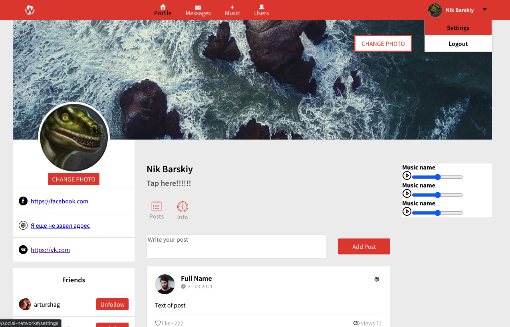

## Social Network

### Technologies:

`Sass` `JavaScript` `React` `TypeScript` `Redux` `REST API` `Redux-thunk` `Axios`

#### [>Try the app<](https://lacuba.github.io/social-network/#/login)

###How to launch a project:

1. Clone this project.
2. Install the necessary packages with the command: **`npm install`**
3. Start the server with the command: **`npm start`**

---

### Как запустить проект:

1. Клонировать этот проект.
2. Установить нужные пакеты командой: **`npm install`**
3. Запустить сервер командой: **`npm start`**

#### [>Попробуй приложение<](https://lacuba.github.io/social-network/#/login)
